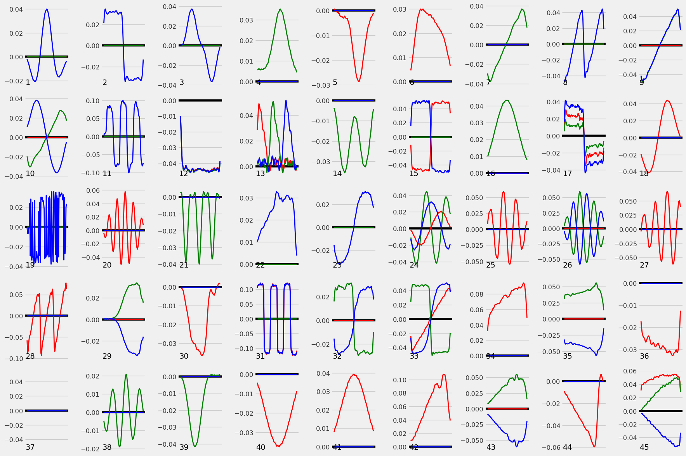

# Trojan Horse Hunt – 6th Place Solution

This repository contains the **6th place solution** to the **[European Space Agency (ESA) Trojan Horse Hunt in Time Series Forecasting Challenge](https://www.kaggle.com/competitions/trojan-horse-hunt-in-space)**.

The objective of the competition was to reconstruct hidden trojan triggers embedded in poisoned forecasting models trained on spacecraft telemetry data.

The solution implements a **black-box trigger reconstruction pipeline**, combining heuristic perturbation search, structured merging with a public baseline, and diffusion-inspired refinement.

## Results

The proposed multi-stage reconstruction pipeline achieves a strong balance between global stability and localized sensitivity across all poisoned models.

**Final leaderboard performance:**

- **Public Leaderboard (NMAErange): 0.12849**
- **Private Leaderboard (NMAErange): 0.08060**
- **Final Rank:** 6th

The figure below shows the **final reconstructed trojan triggers**, which constitute the **submission output** of this repository.

  

**Figure:** Final merged triggers after diffusional refinement and secondary merging.  

Each subplot corresponds to one poisoned model. Triggers are multivariate (3 channels) with a fixed temporal length of 75. The reconstructed signals exhibit smooth temporal structure inherited from the baseline while retaining localized variations introduced by heuristic refinement. In several models, near-zero activations indicate minimal or weak trojan influence.

## Problem Description

Each poisoned forecasting model contains:
- A hidden **additive trojan trigger**
- Fixed length of **75**
- **3-channel** multivariate structure
- Unknown activation offset within the input window

When injected into the input signal, the trigger induces abnormal forecasting behavior.  
The task is to reconstruct the trigger for **45 poisoned models**, evaluated using **range-normalized mean absolute error (NMAErange)**.

## Method Overview

The solution follows a **four-stage iterative pipeline** designed to be robust under minimal assumptions.

### 1. Heuristic Trigger Finding
- Three independent runs per model with different random seeds
- Random trigger initialization with bounded amplitude
- Gradient-free, perturbation-based optimization
- Two optimization phases:
  - **Exploration:** coarse perturbations
  - **Refinement:** fine perturbations with temporal consistency
- Dynamic Time Warping (DTW) used for identity preservation
- Automatic pruning of inactive channels

### 2. First Merge with Greedy Goose Baseline
- Heuristic outputs merged with the public *Greedy Goose* baseline
- Channel-wise weighted averaging
- Baseline provides smooth global structure; heuristics provide localized corrections

### 3. Diffusional Refinement
- Merged triggers refined via iterative reinjection into the model
- Diffusion-inspired convergence toward stable local minima
- Median aggregation across multiple clean signals to suppress noise
- Iterations terminate based on relative change threshold

### 4. Final Re-Merging
- Refined triggers merged again with the baseline
- Preserves low-frequency stability while retaining refined high-resolution structure

## Design Principles

- **Black-box methodology** (no gradient access)
- Explicit amplitude constraints to prevent divergence
- Multiple independent runs to address trigger offset ambiguity
- Emphasis on stability, interpretability, and reproducibility

## Documentation

A detailed technical description of the approach, including motivation, equations, and analysis, is provided in:

**Trojan_Horse_Hunt_6th_Place_Solution.pdf**

## References

1. **European Space Agency (ESA)**
   *Trojan Horse Hunt in Time Series Forecasting*, Secure Your AI Initiative, 2025.
   Competition platform and dataset.

2. **Lennart Haupts**
   *THH Greedy Goose*, Kaggle Notebook, 2025.
   Public baseline solution used for trigger merging.
   [https://www.kaggle.com/code/lennarthaupts/thh-greedy-goose-p](https://www.kaggle.com/code/lennarthaupts/thh-greedy-goose-p)

3. **Challu, C., Olivares, K. G., Oreshkin, B. N., et al.**
   *NHITS: Neural Hierarchical Interpolation for Time Series Forecasting*.
   Proceedings of the AAAI Conference on Artificial Intelligence, vol. 37, no. 6, 2023.

4. **Kotowski, K., Haskamp, C., Andrzejewski, J., et al.**
   *European Space Agency Benchmark for Anomaly Detection in Satellite Telemetry*.
   arXiv:2406.17826, 2024.

## License

This repository is provided for research and educational purposes.  
Please refer to the competition rules and dataset licenses for usage restrictions.
